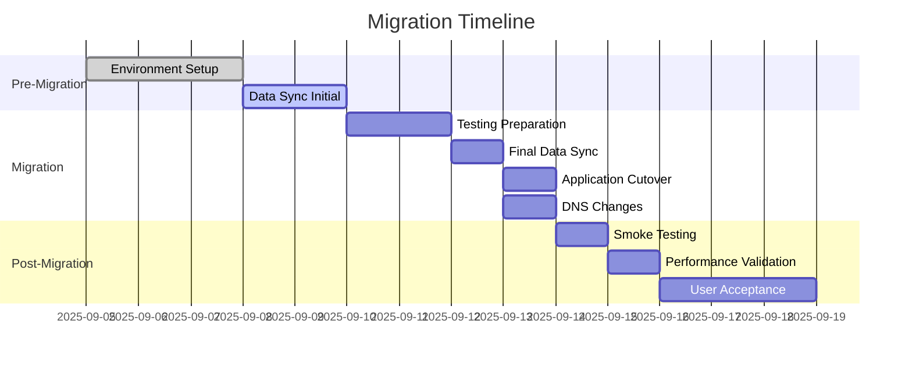

> [!CAUTION]
> **NOTE:** Please refer to the [Application Migration Template](https://github.com/monowar-mukul/cloud_related/blob/main/application-migration-template.md) for full details.
> This is a **DRAFT** for different template. 
[Application Migration Template](https://github.com/monowar-mukul/cloud_related/blob/main/application-migration-template.md)
# Application Migration Project Plan Template

---

## Document Control

| Field             | Value                         |
|-------------------|-------------------------------|
| Application Name  | Customer Portal               |
| Application ID    | APP-1029                      |
| Migration Wave    | Wave 2                        |
| Project Manager   | Sarah Johnson                 |
| Technical Lead    | Michael Chen                  |

---

## Document History

| Version | Issue Date | Changes       | Author   |
|---------|------------|---------------|----------|
| 0.1     | 2025-08-01 | Initial draft | M. Chen  |
| 1.0     | 2025-09-01 | Approved      | S. Johnson |

---

## Document Approvals

| Role              | Name          | Signature | Date       |
|-------------------|---------------|-----------|------------|
| Application Owner | David Roberts |           | 2025-09-03 |
| Technical Lead    | Michael Chen  |           | 2025-09-03 |
| Security Lead     | Priya Patel   |           | 2025-09-04 |
| Project Manager   | Sarah Johnson |           | 2025-09-04 |

---

# 1. Application Overview

## 1.1 Application Description
- **Business Function:** Provides online customer account management, billing, and support services.  
- **Technology Stack:** Windows Server 2016, IIS, Oracle 12c, .NET Framework 4.7  
- **Current Environment:** On-premises data center (Sydney) with 4 VMs and Oracle RAC cluster  
- **Business Criticality:** High – required for customer billing and SLA compliance  

## 1.2 Migration Objectives
**Primary Goals:**  
- [x] Improve performance and scalability  
- [x] Reduce operational costs  
- [x] Enhance security posture  
- [x] Modernize infrastructure  

**Success Criteria:**  
- Application functionality maintained post-migration  
- Response times ≤ 300ms under load  
- PCI-DSS compliance validated  
- Operations handover completed with updated runbooks  

## 1.3 Migration Strategy
- **Selected Strategy:** Replatform (Azure VM)  
- **Justification:** Reduces management overhead while preserving business logic  
- **Migration Pattern:** Lift-and-Shift with partial modernization  

---

# 2. Current State Assessment

## 2.1 Technical Architecture

**Server Details:**

| Server Name  | Role        | OS              | CPU  | Memory | Storage | Dependencies |
|--------------|-------------|-----------------|------|--------|---------|--------------|
| CUST-APP-01  | App Server  | Windows 2016    | 8 vCPU | 32 GB | 500 GB | IIS, .NET    |
| CUST-DB-01   | DB Primary  | Oracle Linux 7  | 16 vCPU| 64 GB | 1 TB   | Oracle 12c   |
| CUST-DB-02   | DB Standby  | Oracle Linux 7  | 16 vCPU| 64 GB | 1 TB   | Oracle 12c   |

**Database Information:**
- Type: Oracle 12c Enterprise Edition  
- Version: 12.2.0.1  
- Size: 2 TB  
- Backup Strategy: RMAN nightly, weekly full, 30-day retention  

**Network Configuration:**
- Current Subnets: 10.10.0.0/24 (App), 10.10.1.0/24 (DB)  
- Firewall Rules: Allow HTTPS (443), SQLNet (1521) internal only  
- Load Balancers: F5 LTM  
- External Connections: Payment Gateway, CRM SOAP API  

## 2.2 Dependencies

**Application Dependencies:**

| Dependency Type | System/Service     | Impact Level | Migration Considerations |
|-----------------|--------------------|--------------|--------------------------|
| Database        | Oracle 12c         | High         | Replace with Azure SQL Managed     |
| File System     | Shared SMB Storage | Medium       | Migrate to EFS           |
| Web Service     | Payment Gateway    | High         | Update endpoint configs  |
| API             | Salesforce CRM     | Medium       | Validate OAuth flow      |

**Infrastructure Dependencies:**
- Active Directory: Yes – used for authentication  
- DNS Requirements: customerportal.company.com  
- Certificate Dependencies: TLS cert from DigiCert  
- Monitoring Tools: SolarWinds, AppDynamics  

## 2.3 Security Assessment
**Current Security Controls:**  
- [x] Antivirus software (Symantec)  
- [x] Endpoint protection  
- [x] Network segmentation  
- [x] Access controls (AD groups)  
- [x] Encryption at rest (Oracle TDE)  
- [x] Encryption in transit (TLS 1.2)  

**Compliance Requirements:** PCI-DSS, ISO 27001  

## 2.4 Performance Baseline
**Current Performance Metrics:**
- CPU Utilization: 45% avg, 70% peak  
- Memory Utilization: 65% avg, 85% peak  
- Disk I/O: 10K IOPS peak  
- Network Throughput: 200 Mbps peak  
- Response Times: 250ms average under 1K users  

---

# 3. Target State Design

## 3.1 Azure Architecture

| Field | Value |
|---|---|
| Target Azure Subscription | `xxxxxxxx-xxxx-xxxx-xxxx-xxxxxxxxxxxx` |
| Target Region | `australiaeast` (Sydney) |
| Availability Zones | `australiaeast-1`, `australiaeast-2` |

### Compute Resources

| Component | Azure Service | Instance Type | Sizing Rationale |
|---|---|---|---|
| Application Server | Azure Virtual Machine | `Standard_D4s_v5` (4 vCPU, 16 GB RAM) | Matches CPU/memory needs |
| Database | Azure Virtual Machine — Oracle DB (BYOL) | `Standard_E16s_v5` (16 vCPU, 128 GB RAM) | CPU/IO throughput required |

### Storage Design

| Layer | Azure Service | Size | Tier |
|---|---|---|---|
| Root Volume | Azure Managed Disk (OS Disk) | 100 GB | Premium SSD (P10) |
| App Data Volume | Azure Managed Disk | 500 GB | Premium SSD (P20) |
| DB Data Volume | Azure Managed Disk | 2 TB | Ultra Disk / Premium SSD P40 |
| Backup | Azure Backup + Azure Blob Storage (LRS) | — | Daily snapshots, PITR enabled |

### Network Configuration

| Field | Value |
|---|---|
| Virtual Network (VNet) | `vnet-psolis-prod-aue` |
| App Subnet | `10.20.0.0/24` |
| DB Subnet | `10.20.1.0/24` |
| Network Security Groups | Allow HTTPS (443), Oracle (1521) within VNet only |
| Load Balancer | Azure Application Gateway (WAF v2) for HTTPS traffic |

---

## 3.2 Security Design

### Security Controls

- [ ] Azure RBAC roles and policies defined
- [ ] Network Security Groups (NSGs) configured
- [ ] Azure Firewall / route tables configured
- [ ] Azure Disk Encryption (ADE) enabled for all VM disks
- [ ] Azure Defender for SQL / Oracle VM enabled
- [ ] Microsoft Defender for Cloud enabled
- [ ] Azure Monitor & Log Analytics workspace configured
- [ ] Azure Bastion enabled (replaces Session Manager)
- [ ] Microsoft Sentinel configured for SIEM

### Compliance Validation

- [ ] NSG rules reviewed and validated
- [ ] Encryption standards (AES-256) met for disks and storage
- [ ] Azure Storage access logging configured
- [ ] Azure Monitor / Defender alerts active
- [ ] Azure Policy compliance checks passing

---

# 4. Migration Plan

## 4.1 Migration Approach

| Field | Value |
|---|---|
| Migration Method | Azure Migrate (server replication) + Azure Database Migration Service (DMS) for Oracle DB |
| Migration Window | 8 hours (weekend cutover) |
| Rollback Plan | Failback to on-premises Oracle + DNS revert |

## 4.2 Pre-Migration Activities

- [ ] Application discovery completed
- [ ] Performance baseline established
- [ ] Test plan approved
- [ ] Migration runbook created
- [ ] Azure resources provisioned
- [ ] Security validation completed
- [ ] Backup verification completed
- [ ] Stakeholder communication sent
## 4.3 Migration Timeline

# 5. Testing Strategy

## 5.1 Test Plan Overview

- **Testing Approach:** Hybrid (automated + manual)
- **Test Environment:** Staging environment in AWS
- **Testing Tools:** JMeter, Selenium, AWS Inspector

## 5.2 Test Scenarios

| Test Type | Description | Acceptance Criteria | Owner |
|-----------|-------------|---------------------|-------|
| Functional | Customer login, billing | 100% pass rate | QA Lead |
| Performance | 1K concurrent users | ≤ 300ms response time | Perf Engineer |
| Security | IAM roles, SG rules | No high-risk vulnerabilities | Security Lead |
| Integration | CRM API, Payment Gateway | All integrations successful | App Team |
| DR | Backup/restore validation | RTO ≤ 2h, RPO ≤ 15m | DBA |

## 5.3 Rollback Criteria

- [ ] Critical functionality failure
- [ ] Response times exceed 500ms
- [ ] Security vulnerabilities found
- [ ] Data corruption detected

---

# 6. Risk Assessment

## 6.1 Migration Risks

| Risk | Impact | Probability | Mitigation Strategy | Owner |
|------|--------|-------------|-------------------|-------|
| Data loss during migration | High | Low | Multi-level backups + PITR | DBA |
| Extended downtime | Medium | Medium | Weekend cutover + rollback | PM |
| Performance issues | Medium | Medium | Load testing pre/post-migration | Perf Eng. |
| Integration failures | High | Low | API mocks & staging validation | App Lead |

---
# Target Architecture Components by Environment

##  Shared / Cross-Environment Components

| Logical Component Name | Description | Details |
|---|---|---|
| DCCEEW Azure Tenant | Top-level Azure boundary | Hosts all Non-Prod and Prod environments within DCCEEW Azure cloud |
| Azure Sentinel | Security monitoring / SIEM | Threat detection and incident response across all environments |
| Azure Monitor | Infrastructure monitoring | Monitors metrics, logs and availability across all Azure resources |
| Microsoft Entra ID | Identity & Access Management | HTTPS-based authentication and authorisation for all DCCEEW users |
| Azure DevOps | CI/CD & release management | Manages deployment pipelines and automated releases across all environments |
| Internal Application Gateway (Non-Prod) | L7 load balancer – Dev & Test | REST/HTTPS ingress routing, SSL termination and WAF for Dev and Test VNETs |
| Internal Application Gateway (Prod) | L7 load balancer – Prod only | REST/HTTPS ingress routing, SSL termination and WAF for Production VNET |
| Power BI | Reporting & BI platform | Consumes data via HTTPS from both Non-Prod and Prod environments |
| SharedInfra Asset: Oracle Workspace | Shared Oracle infrastructure boundary | Logical grouping of all Oracle DB tiers across Dev, Test, Prod and OEM |
| Environment Asset: LARA Workspace | Application layer workspace | Logical boundary encapsulating LARA application components across all VNETs |
| Landscape: Non-Prod Legacy Subscription | Source legacy Oracle 12c – Non-Prod | On-prem / legacy subscription hosting source Oracle 12c Dev and Test databases |
| Landscape: Prod Legacy Subscription | Source legacy Oracle 12c – Prod | On-prem / legacy subscription hosting source Oracle 12c Production database |
| DCCEEW User | End-user access persona | Users accessing the platform via HTTPS through Application Gateway |

---

##  Environment: DEV

| Logical Component Name | Description | Details |
|---|---|---|
| Dev VNET | Isolated virtual network – Development | Hosts all Dev workloads; segmented into Apps/Web Subnet and Data Subnet with NSG controls |
| Apps/Web Subnet – Dev | Application tier subnet – Dev | Hosts Oracle Windows Server VM and Oracle REST Web Services for Dev environment |
| Oracle Windows Server VM – Dev | App server hosting APEX & ORDS – Dev | Windows VM running Oracle APEX 22.2 and Oracle REST Data Services; connects via TCPS to Oracle DB 19c |
| Oracle REST Web Services / ORDS – Dev | REST API middleware – Dev | Exposes Oracle DB via RESTful APIs between Application Gateway and Oracle DB tier in Dev |
| Log Analytics Workspace – Dev | Log aggregation – Dev | Collects and stores application logs from Dev workloads; feeds into Azure Monitor and Sentinel |
| Data Subnet with NSG – INTLD | Secured data tier subnet – Dev | NSG-controlled subnet hosting Oracle 19c + APEX 22.2 in Dev; isolated from Apps/Web subnet |
| Oracle DB 19c – Dev | Target Oracle database – Dev | Oracle 19c on Azure Linux VM; target of expdp/impdp migration from on-premises Oracle 12c Dev schema |
| Linux VM – Dev (DB Host) | Compute hosting Oracle 19c – Dev | Azure Linux VM sized for Dev workload; hosts Oracle 19c database engine |
| Storage Azure Files – Dev | Shared file storage – Dev | Azure Files shares for Oracle datafiles, Data Pump dump files, backups and application storage in Dev |
| Gateway Subnet with NSG DEV | Hybrid gateway subnet – Dev | NSG-controlled subnet hosting On-premises Data Gateway for Dev environment |
| On-premises Data Gateway – Dev | Hybrid connectivity bridge – Dev | Facilitates secure HTTPS data transfer between on-prem legacy Oracle 12c source and Azure Dev environment |
| Windows VM – Dev (Gateway Host) | Gateway agent host – Dev | Windows VM running On-premises Data Gateway agent; connects outbound HTTPS to Azure services |

---

##  Environment: TEST

| Logical Component Name | Description | Details |
|---|---|---|
| Test VNET | Isolated virtual network – Test | Hosts all Test workloads; mirrors Dev VNET topology for pre-production validation |
| Apps/Web Subnet – Test | Application tier subnet – Test | Hosts Oracle Windows Server VM and Oracle REST Web Services for Test environment |
| Oracle Windows Server VM – Test | App server hosting APEX & ORDS – Test | Windows VM running Oracle APEX 22.2 and Oracle REST Data Services; connects via TCPS to Oracle DB 19c |
| Oracle REST Web Services / ORDS – Test | REST API middleware – Test | Exposes Oracle DB via RESTful APIs between Application Gateway and Oracle DB tier in Test |
| Log Analytics Workspace – Test | Log aggregation – Test | Collects and stores application logs from Test workloads; feeds into Azure Monitor and Sentinel |
| Data Subnet with NSG – INTLT | Secured data tier subnet – Test | NSG-controlled subnet hosting Oracle 19c + APEX 22.2 in Test; isolated from Apps/Web subnet |
| Oracle DB 19c – Test | Target Oracle database – Test | Oracle 19c on Azure Linux VM; target of expdp/impdp migration from on-premises Oracle 12c Test schema |
| Linux VM – Test (DB Host) | Compute hosting Oracle 19c – Test | Azure Linux VM sized for Test workload; hosts Oracle 19c database engine |
| Storage Azure Files – Test | Shared file storage – Test | Azure Files shares for Oracle datafiles, Data Pump dump files, backups and application storage in Test |

---

## Environment: PROD

| Logical Component Name | Description | Details |
|---|---|---|
| Prod VNET | Isolated virtual network – Production | Hosts all Production workloads; fully isolated with strictest NSG rules and Prod-specific gateways |
| Apps/Web Subnet – Prod | Application tier subnet – Prod | Hosts Oracle Windows Server VM and Oracle REST Web Services for Production environment |
| Oracle Windows Server VM – Prod | App server hosting APEX & ORDS – Prod | Windows VM running Oracle APEX 22.2 and Oracle REST Data Services; connects via TCPS to Oracle DB 19c |
| Oracle REST Web Services / ORDS – Prod | REST API middleware – Prod | Exposes Oracle DB via RESTful APIs between Application Gateway and Oracle DB tier in Production |
| Log Analytics Workspace – Prod | Log aggregation – Prod | Collects and stores application logs from Prod workloads; feeds into Azure Monitor and Sentinel |
| Data Subnet with NSG – INTLP | Secured data tier subnet – Prod | NSG-controlled subnet hosting Oracle 19c + APEX 22.2 in Prod; highest security NSG ruleset applied |
| Oracle DB 19c – Prod | Target Oracle database – Production | Oracle 19c on Azure Linux VM; primary migration target for on-premises Oracle 12c Production schema |
| Linux VM – Prod (DB Host) | Compute hosting Oracle 19c – Prod | Azure Linux VM appropriately sized for Production workload; hosts Oracle 19c database engine |
| Storage Azure Files – Prod | Shared file storage – Prod | Azure Files shares for Oracle datafiles, Data Pump dump files, backups and application storage in Prod |
| Data Subnet with NSG – OEM | Dedicated OEM subnet – Prod only | Hosts Oracle Enterprise Manager 19c for centralised DB monitoring and management; exists in Prod only |
| Oracle DB 19c – OEM | Oracle Enterprise Manager database – Prod | Oracle 19c instance dedicated to OEM repository; monitors all Oracle DB targets across environments |
| Linux VM – OEM (DB Host) | Compute hosting OEM – Prod | Azure Linux VM hosting Oracle 19c OEM; Prod-only component for enterprise DB monitoring |
| Storage Azure Files – OEM | File storage for OEM – Prod | Azure Files shares dedicated to OEM datafiles and backup storage |
| Gateway Subnet with NSG PRD | Hybrid gateway subnet – Prod | NSG-controlled subnet hosting On-premises Data Gateway for Production environment |
| On-premises Data Gateway – Prod | Hybrid connectivity bridge – Prod | Facilitates secure HTTPS data transfer between on-prem legacy Oracle 12c source and Azure Prod environment during migration and post-cutover |
| Windows VM – Prod (Gateway Host) | Gateway agent host – Prod | Windows VM running On-premises Data Gateway agent in Production; connects outbound HTTPS to Azure services |

---

> **Migration Note:** **Azure Files** acts as the dump file staging area, and the **On-premises Data Gateway** in both Non-Prod (Dev) and Prod provides the hybrid bridge for the expdp dump transfer from Oracle 12c on-prem to Oracle 19c on Azure.

---

##  Shared / Cross-Environment

| Environment | Tier | Qty | Azure Service | Service Description | Metric Size | Metric Type | Notes |
|---|---|---|---|---|---|---|---|
| Non-Production | Shared | | Azure Blob Storage | Object Storage Requests | 386 | GB/Month | |

---

##  Application Tier

| Environment | Tier | Qty | Azure Service | Service Description | Metric Size | Metric Type | Notes |
|---|---|---|---|---|---|---|---|
| Non-Production | Application | 2 | Azure Virtual Machines (D4s v5) | VM Compute — 4 vCPU equivalent | 1 | vCPU/Hr | Replaces OCI E4 Flex 1 OCPU |
| | | | | VM Memory — 16 GB RAM | 16 | GB/Hr | E4 Flex Memory — 16 GB RAM |
| | | | Azure App Service / WebLogic on Azure | WebLogic Server Marketplace Image | 1 | vCPU/Hr | WLS-EE Marketplace Image |
| | | 2 | Azure Managed Disks (P10/P20) | Primary Storage — Block Disk | 150 | GB/Month | 3 × 50 GB Volumes per WLS |
| | | | | Primary Storage — Performance Units | 1,500 | GB/Month | Standard Performance — 10 × VPU per GB |
| | | 2 | Azure Blob Storage (LRS) | Backup Storage | 2,100 | GB/Month | 60-Day Rolling Retention |
| | | | | Backup Storage Requests | 21 | GB/Month | |

---

##  Database Tier (DEV)

| Environment | Tier | Qty | Azure Service | Service Description | Metric Size | Metric Type | Notes |
|---|---|---|---|---|---|---|---|
| Non-Production | Database (QAS, DEV, PROJ) | 3 | Azure Virtual Machines — Oracle DB (E4s v5) | DBCS-VM Single Instance — 1 vCPU BYOL | 1 | vCPU/Hr | Oracle DB on Azure VM — BYOL |
| | | 3 | Azure Managed Disks (P30 — Premium SSD) | Primary Storage — Block Disk | 2,760 | GB/Month | ASM: 2048 DATA + 512 RECO |
| | | | | Primary Storage — High Perf Units | 55,200 | GB/Month | High Performance — 20 × VPU per GB |
| | | 3 | Azure Blob Storage (LRS) | Backup Storage | 5,000 | GB/Month | Ad-hoc Backup as required |
| | | | | Backup Storage Requests | 50 | GB/Month | |

---

> **Note:** Azure Managed Disk tiers (Standard/Premium). Object Storage mapped to Azure Blob Storage (LRS). BYOL licensing applicable for Oracle DB on Azure VMs.

---
# Component Upgrade Matrix

| Function | Component | Current Version | Current Support | Target Upgrade | Target Support |
|---|---|---|---|---|---|
| **Application Server** | Operating System | Windows 2xxx | Out of Support / up to | Oracle Linux 7.9 | |
| | Web Server (NZAKLEVFN584) | Oracle HTTP Server 11g | | WebLogic 12c | |
| | Forms and Reports Web Server (NZAKLEVFN279) | Oracle HTTP Server 11g, WebLogic 11g | | WebLogic 12c | |
| | Java Versions | TBD | | TBD | |
| | Oracle REST Data Services | n/a | n/a | ORDS 21.4.3 | |
| **Database Servers** | Operating System | Red Hat Linux 5 | Out of Support since xxxx | Oracle Linux 7.9 | |
| | Database | Oracle 11g | Extended Support until xxx | Oracle 19c | 30 Apr 2027 |
| **Client Application** | Apex Client | Apex 4.2 | | Apex 22.2 | Oct 2025 |

---
# Infrastructure Design Document

---

## Database Server Nodes

### Requirements — MEL

| Field | Value |
|---|---|
| Description | |
| Region | |
| Compartment | |
| Database Home | |
| Database | |
| OS | |
| OU | |
| CPU | |
| RAM | |
| Storage (local) | |
| Database version | |

---

## Application Server Nodes

### Requirements

| Field | Value |
|---|---|
| Server Name | |
| Description | |
| Azure Region | |
| VCN | |
| IP and Subnet | |
| Machine Image | |
| Image Shape | |
| OS | |
| Infrastructure | |
| OU | |
| CPU | |
| RAM | |
| Disk 1 | |
| Disk 2 | |
| Software | |
| Certificates | |

---

## Cross-Region High Availability

### Application Servers

Cross-region high availability will be provided by the F5 load balancer located in the DPC platform.

> All load balancer TLS server profiles should be configured to only offer TLSv1.2 or greater and remove support for insecure or deprecated ciphers (refer to SRM team for current guidance).

---

### Load Balancer Definition — PROD PSOLIS 443 (Java Web Start)

**Application**

| Field | Value |
|---|---|
| Name | |
| Application Class | |
| Environment | |

**Virtual Server**

| IP | FQDN | Protocol | Port/Range |
|---|---|---|---|
| | | | |

**Backend Servers**

| Server Name | IP Address | Service Port | Location |
|---|---|---|---|
| | | | |
| | | | |

**Server Health Monitoring**

| Field | Value |
|---|---|
| Type of Monitor | HTTP |
| Port No. | 8080 |
| Interval (sec) | 5 |
| Timeout (sec) | 16 |
| Up Interval (sec) | |
| URL Path | |
| Expected Response Code | |

---

### Load Balancer Definition — PROD WebPSOLIS 443

**Application**

| Field | Value |
|---|---|
| Name | |
| Application Class | |
| Environment | PROD |

**Virtual Server**

| IP | FQDN | Protocol | Port/Range |
|---|---|---|---|
| | | | |

**Backend Servers**

| Server Name | IP Address | Service Port | Location |
|---|---|---|---|
| | | | |
| | | | |

**Server Health Monitoring**

| Field | Value |
|---|---|
| Type of Monitor | HTTPS |
| Port No. | 443 |
| Interval (sec) | 5 |
| Timeout (sec) | 16 |
| Up Interval (sec) | |
| URL Path | |
| Expected Response Code | |

**Connection**

| Field | Value |
|---|---|
| Load Balancing Algorithm | Round Robin |
| Priority Group Activation | No |
| Preferred Server | N/A |
| SSL Encryption | Yes |
| SSL Method | |
| Session Persistence | Yes |
| Certificate Source | |
| iRule | |

---

## Network / Security Components

### DNS Records

> **Note:** DNS records that already exist for the current PSOLIS environment will need to be modified during cutover as a scheduled activity. All other DNS records are new and can be created during implementation.

| FQDN | Record Type | Target | TTL |
|---|---|---|---|
| | A | | 3600 |
| | CNAME | | 3600 |

---

### Firewall Rules — FortiGate Datacentre Firewall (East/West)

**Server Groups**

| Group Name | Servers | IP Address |
|---|---|---|
| UAT App Servers | | |
| | | |
| DEV Build Server | | |
| TRA/TEST/SUPP App Servers | | |
| PROD App Servers | | |
| | | |
| TRA DB Servers | | |
| | | |
| UAT DB Servers | | |
| | | |
| DEV DB Servers | | |
| | | |
| PROD DB Servers | | |
| | | |

**Rules**

| Source | Destination | Port | Comments |
|---|---|---|---|
| | | | |

---

### Firewall Rules — AWS Security Lists

| Source | Destination | Port | Comments |
|---|---|---|---|
| DC1 | DC2 | TCP 1521–1545 | Replication between regions |
| | | TCP 1521–1545 | DB replication between regions |

---

### TLS Certificates

| Environment | Service Layer | Common Name / SANs | Issuing CA |
|---|---|---|---|
| UAT | Application Server | | |
| Production | Application Server | | |
| Test/Train/Support | Application Server | CN:  SAN: | |
| Dev | Application Server | | |

---

## System Management Components

### Backups

#### Application Servers

Atos will manage application server and database backups.

| Policy | Schedule | Retention |
|---|---|---|
| Prod | Daily Backup @ 22:00 | 30 days |
| UAT / Non-Prod | Daily Backup @ 20:00 | 14 days |

#### Databases

Oracle databases will be protected against:

- **Logical failure** — e.g. corrupt DB or accidental data deletion
- **Technical failure** — e.g. double disk failure
- **Disaster** — e.g. datacentre fire

Backups use **RMAN (Recovery Manager)**, optionally combined with an agent-based tool such as Avamar. RMAN is Oracle's native backup and recovery infrastructure and the recommended option for Oracle backup and restore activities.

RMAN key capabilities include:

- Online database backups without placing tablespaces in backup mode
- Incremental backups
- Data block integrity checks during backup and restore operations
- Test backups and restores without performing the actual operation
- Automated tablespace point-in-time recovery and block media recovery

For Oracle software binaries, Avamar may also be utilised.

**Database Backup Policy**

| Field | Value |
|---|---|
| Frequency | Daily |
| Schedule | TBC based on current |
| Retention | 28 days |

---

### Patching Windows

#### Application Server Patching

Atos will manage server patching.

| Environment | Server | Patch Window | Week | Time |
|---|---|---|---|---|
| Prod | | | | |
| | | | | |
| UAT | | | | |
| | | | | |
| Non-Prod | | | | |
